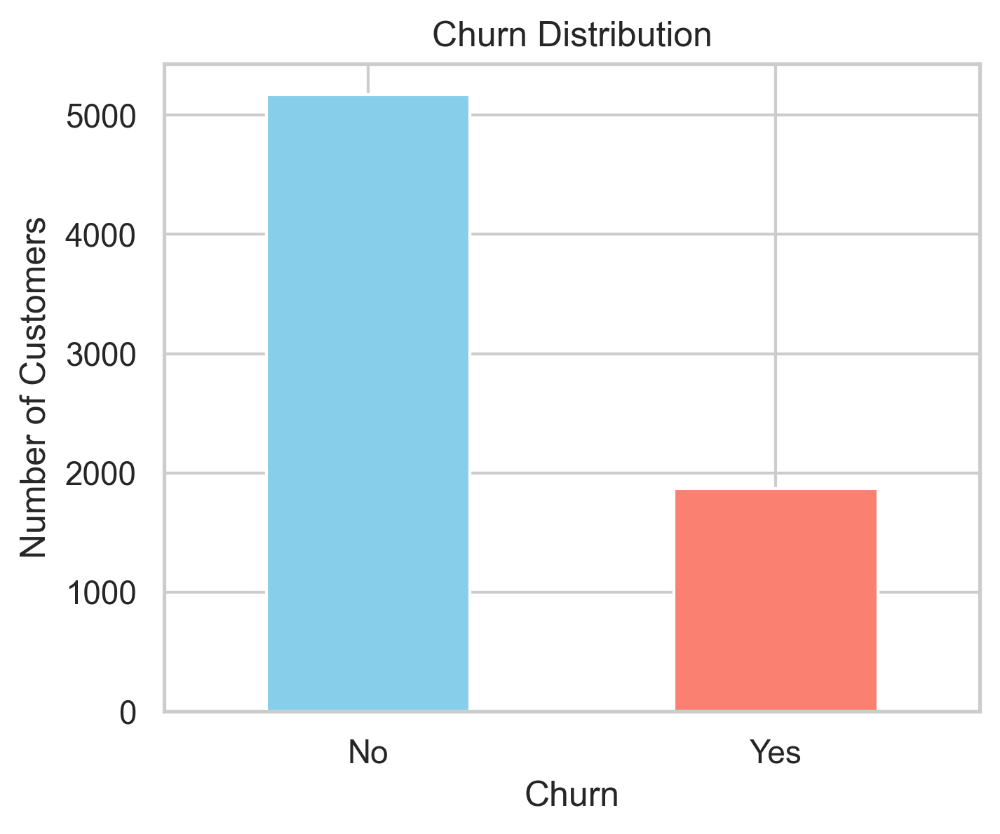
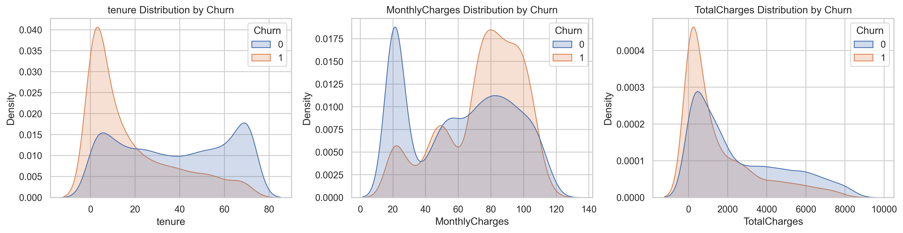
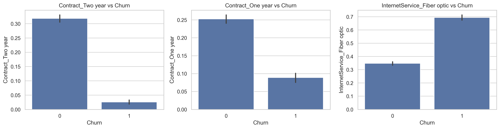

# Telco_Customer_Churn_Analysis
## Overview
This project analyzes customer churn for a telecommunications company using machine learning.
The goal is to predict whether a customer will leave the company and identify the key factors that drive churn.
The analysis includes data preprocessing, exploratory analysis, model building, and performance evaluation using recall-focused optimization.

## Business Objective

Customer churn directly affects business revenue.  
Predicting churn early allows the company to take proactive steps to retain customers through targeted offers or improved services.

### Main Goals
- Build a predictive model to classify customers as **Churn** or **Non-Churn**.  
- Improve **Recall** to capture as many churners as possible.  
- Provide **actionable business insights** based on feature importance.

## Dataset Information

**Source:** [Telco Customer Churn Dataset (Kaggle)](https://www.kaggle.com/blastchar/telco-customer-churn)  

**File Used:** `WA_Fn-UseC_-Telco-Customer-Churn.csv`  
**Records:** 7,043 customers  
**Features:** 21 customer-related variables and 1 target (**Churn**)

### Key Columns

| Feature | Description |
|----------|--------------|
| customerID | Unique ID for each customer |
| gender | Male or Female |
| SeniorCitizen | 1 if customer is a senior citizen |
| Partner | Whether the customer has a partner |
| Dependents | Whether the customer has dependents |
| tenure | Number of months the customer has stayed |
| PhoneService | Whether the customer has phone service |
| InternetService | Type of internet service (DSL, Fiber optic, None) |
| Contract | Contract type (Month-to-month, One year, Two year) |
| PaymentMethod | Payment type (Electronic check, Bank transfer, etc.) |
| MonthlyCharges | Amount charged monthly |
| TotalCharges | Total amount charged |
| Churn | Target variable (Yes = churned, No = retained) |

## Tools and Libraries

**Language:** Python  
**Environment:** Jupyter Notebook  

**Libraries Used:**  
- pandas  
- numpy  
- matplotlib  
- seaborn  
- scikit-learn  
- imbalanced-learn (SMOTE)  
- reportlab (for PDF reporting)  

## Data Preprocessing Steps

- Converted **TotalCharges** to numeric and handled 11 missing values.  
- Replaced "No internet/phone service" with "No".  
- Encoded binary columns (**Yes/No**) as **1/0**.  
- One-hot encoded multi-category features.  
- Scaled numerical features using **StandardScaler**.  
- **Final dataset shape:** 7,043 rows × 24 columns  

## Exploratory Data Analysis (EDA)

### Insights
- **Churn rate:** 26.6%  
- Customers with **month-to-month contracts**, **high monthly charges**, and **short tenure** are most likely to churn.  
- Customers with **Fiber optic internet** or paying via **Electronic check** have higher churn.  
- **Long-term contracts** (One-year or Two-year) reduce churn.  

### Example Visuals
- Distribution of churn 

- Number of features Distribution

- Category features vs Churn

